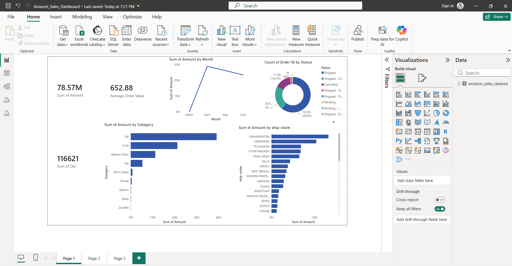
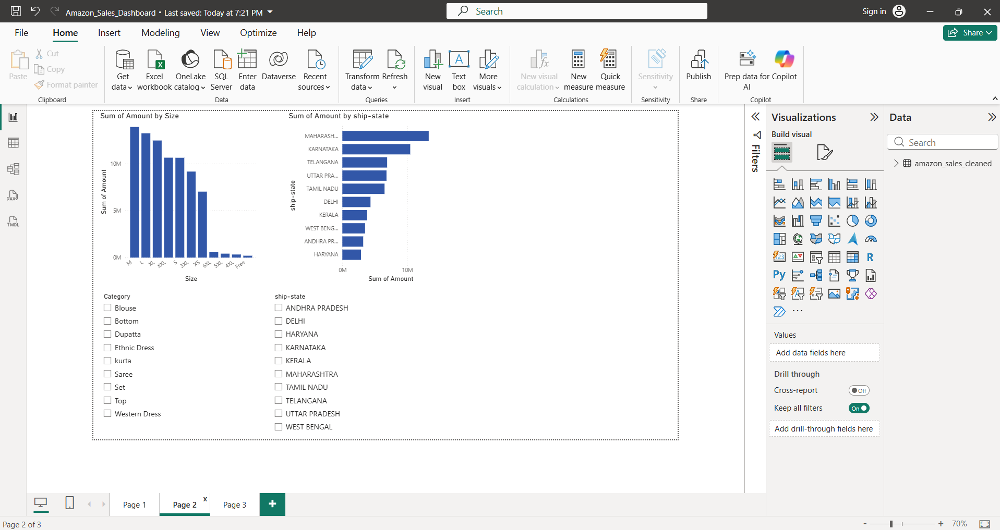
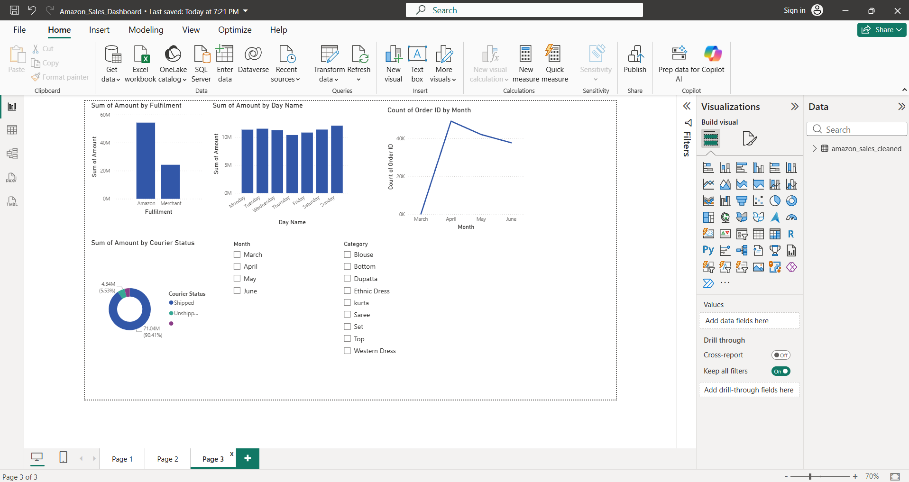

#  Amazon Sales Analytics

An end-to-end Data Analytics project built using Python, SQL, and Power BI to analyze Amazon sales data and generate business insights.

---

##  Project Overview

This project demonstrates the complete Data Analytics workflow:

- Data Cleaning using Python
- Data Analysis using SQL
- Dashboard Development using Power BI
- Data Visualization
- Business Insights

---

##  Tools & Technologies

- Python
- Pandas
- NumPy
- SQL (MySQL)
- Power BI
- Git
- GitHub

---

##  Project Structure

Amazon-Sales-Analytics/

├── data/

├── output/

├── sql/

├── powerbi/

├── reports/

├── images/

├── cleaning.py

├── analysis.py

├── README.md

└── requirements.txt

---

##  Key Performance Indicators

- Total Orders: 102
- Total Revenue: ₹63,770.79
- Average Order Value: ₹625.20
- Categories: 6
- States Covered: 1

---

##  Analysis Performed

- Revenue Analysis
- Category Analysis
- Order Status Analysis
- State-wise Sales
- City-wise Sales
- Fulfilment Performance
- Monthly Revenue Trends

---

##  Dashboard Preview

### Sales Dashboard

### Revenue Dashboard

### Category Dashboard

---

##  Author

Yashwanth Kumar M
